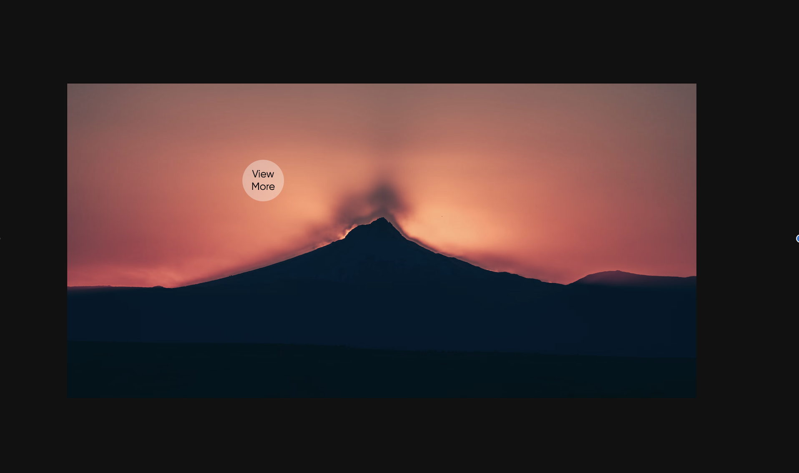

# Cursor Image Project

This project showcases a dynamic cursor effect combined with interactive animations using GSAP (GreenSock Animation Platform).

## Description

The HTML (`index.html`), CSS (`style.css`), and JavaScript (`script.js`) files collectively create a visually engaging webpage featuring:

- A responsive layout with a centered image (`#image`) and overlay effects.
- Custom cursor (`#cursor`) that dynamically follows the user's mouse movements.
- GSAP animations for smooth transitions and interactive elements.

## Features

- **Dynamic Cursor**: The cursor (`#cursor`) moves with the user's mouse, offering a visual enhancement.
- **Interactive Overlay**: Hover effects on the image (`#image`) trigger overlays for additional visual feedback.
- **Responsive Design**: The webpage adjusts seamlessly to different screen sizes.

## Usage

To run the project locally:

1. Clone the repository: `git clone <repository-url>`
2. Open `index.html` in a web browser.

## Technologies Used

- **HTML**: Structure and content presentation.
- **CSS**: Styling and layout of elements.
- **JavaScript (GSAP)**: Animation library for creating interactive effects.

## Preview

## Installation

There are no specific installation steps required beyond cloning the repository. Ensure your browser supports ES6 JavaScript features for optimal performance.

## Contributing

Contributions are welcome! Fork the repository and submit a pull request with your enhancements.

## Credits

- **Image**: [Unsplash](https://unsplash.com)
- **Fonts**: Custom font included via `@font-face`.
- **Libraries**:
  - [GSAP](https://greensock.com/gsap/)

## License

This project is licensed under the MIT License. See the [LICENSE](LICENSE) file for details.

---

Feel free to explore and modify the project. For any questions or suggestions, please open an issue in the repository.